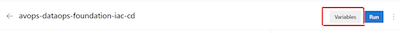

# avops-dataops-foundation-iac-cd

The IaC CD pipeline enables the automatic deployment of your infrastructure. This pipeline supports the deployment of terraform scripts. 

## Pipeline setup

Once you have run the pre-deployment section in the [terraform setup guide](../terraform/root/README.md), access the deployment variables.

```bash

# load the deployment variables
source .avdataops-tf.env

# list out the deployment variables
env | grep ARM

```

Now, create each of the following variables as a secret in Azure DevOps. To get the secret value, refer to the output from the command above, match the corresponding deployment variable and note down the value.

| Secret Name | Deployment Variable | Description | 
| ------------- | ------------- | ------------- |
| appId  | `ARM_CLIENT_ID` | Service Principal app ID | 
| password | `ARM_CLIENT_SECRET` | Service Principal password |
| tenant | `ARM_TENANT_ID` | Service Principal tenant ID |
| subscription | `ARM_SUBSCRIPTION_ID` | Subscription ID of your Azure subscription |
| TF_STORAGE_ACCOUNT_KEY | `ARM_ACCESS_KEY` | Access Key of Azure storage account used for the Terraform backend |

To set the secerts follow these steps - 
1. On the AzDo project go to pipelines and select `avops-dataops-foundation-iac-cd`. 
2. Click on Edit 
  - 
3. Click on Variables. 
  - 
4. Add the variable name and value and select the box `Keep this value secret`
  - 
5. Click on `OK` and the secret will be added. 

## Pipeline parameters 

1. **env** - The type of environment you are trying to set up. You can add more environments by setting up blob containers in your Azure storage account configured as the terraform backend. This container will be dedicated for the terraform state files for the environment.

## Pipeline variables 

1. src_dir - this variable defines the path of the root directory where the main terraform file is present
2. TF_RG_NAME - this variable defines the resource group where the terraform backend storage account is present.
4. TF_CONTAINER_NAME - Storage container name where the state files will be stored.

## Pipeline Stages 

1. install_terraform - Installs the latest version of terraform on the host machine. 
2. tf_plan_and_apply - 
    1. Login to azure with the service principal
    1. Set the service principal credentials as environment variables on the host. This is required by terraform to authenticate to the azure portal.
    1. Initialize the terraform modules with the backend configured. 
    1. Validate the terraform scripts
    1. Plan the terraform deployment.
    1. Deploy the modules to the azure portal. 

## Steps to run the pipeline

1. The pipeline has a manual trigger.
2. After all the prerequisites are set up, in the AzDo project go to pipelines and select `avops-dataops-foundation-iac-cd`
3. Click on `Run Pipeline` and select the branch you wish to deploy from and the environment you wish to set up.


4. Click on `Run` and your pipeline will be triggered. 
