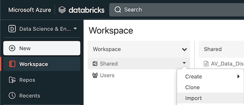

# Data Discovery

Through Azure Databricks, a user can easily search datastreams via the metadata APIs and also make additions to curated datastreams.

## Databricks Setup

The core infrastructure deploys an instance of Azure Databricks out of the box. Prior to running the template notebooks on Databricks, proceed through the following steps to fully initialize the Databricks instance. 

### Initialize Databricks Secrets

For databricks to access the multiple ADLS storage accounts, it will use a [service principal](https://learn.microsoft.com/en-us/azure/databricks/storage/azure-storage#--access-azure-data-lake-storage-gen2-or-blob-storage-using-oauth-20-with-an-azure-service-principal) for authentication. Create a secret for the service principal access key within key vault.

```bash

# Navigate to the root templates dir (repo_dir/core-infrastructure/terraform/root)

source .avdataops-tf.env

# Assign key vault access policy to view secrets
AVOPS_KV_RG_NAME=`az group list --tag environment=$AVOPS_ENV_NAME --query '[].name' -o tsv`
AVOPS_KV_NAME=`az keyvault list -g $AVOPS_KV_RG_NAME --query '[].name' -o tsv`
AVOPS_OBJECT_ID=`az account show --query id`

# Assign key vault access policy
az keyvault set-policy -n $AVOPS_KV_NAME --object-id $AVOPS_OBJECT_ID --secret-permissions set

# Create Service principal secret for Databricks
az keyvault secret set --vault-name $AVOPS_KV_NAME --name "databricks-sp-key" --value $ARM_ACCESS_KEY

# Delete key vault access policy when done 
az keyvault delete-policy -n $AVOPS_KV_NAME --object-id $AVOPS_OBJECT_ID

```

Next, open the Databricks workspace in the Azure Portal. Go to `https://<databricks-instance>#secrets/createScope` for your specific Databricks instance. This URL is case sensitive; scope in `createScope` must be uppercase. Provide the following values in the form to create the secret scope.


```bash

# Scope Name
"databricks-avdataops-scope"

# Manage Principal
"Creator"

# DNS Name
az keyvault list -g $AVOPS_KV_RG_NAME --query '[].properties.vaultUri' -o tsv

# Resource ID
az keyvault list -g $AVOPS_KV_RG_NAME --query '[].id' -o tsv

# Clear env vars
unset `env | grep -E 'AVOPS_|ARM_' | egrep -o '^[^=]+'`

```

For more information on creating the secret scope using the Databricks UI, refer to the [Azure documentation](https://learn.microsoft.com/en-us/azure/databricks/security/secrets/secret-scopes#create-an-azure-key-vault-backed-secret-scope-using-the-ui).

### Initialize Databricks Notebooks

Open the Databricks workspace in the Azure Portal. Go through the follwing steps to get up and running.

1. Create a compute cluster ([docs](https://learn.microsoft.com/en-us/azure/databricks/getting-started/quick-start#step-1-create-a-cluster))
2. Import the template notebooks from this repo's `repo_dir/data-discovery/src` location.
  - 
3. Run through the `AV_Data_Disccovery` notebook in the Databricks UI.
