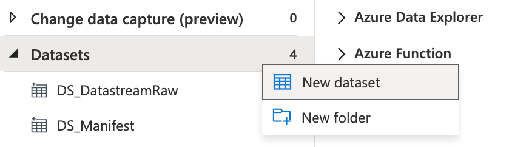
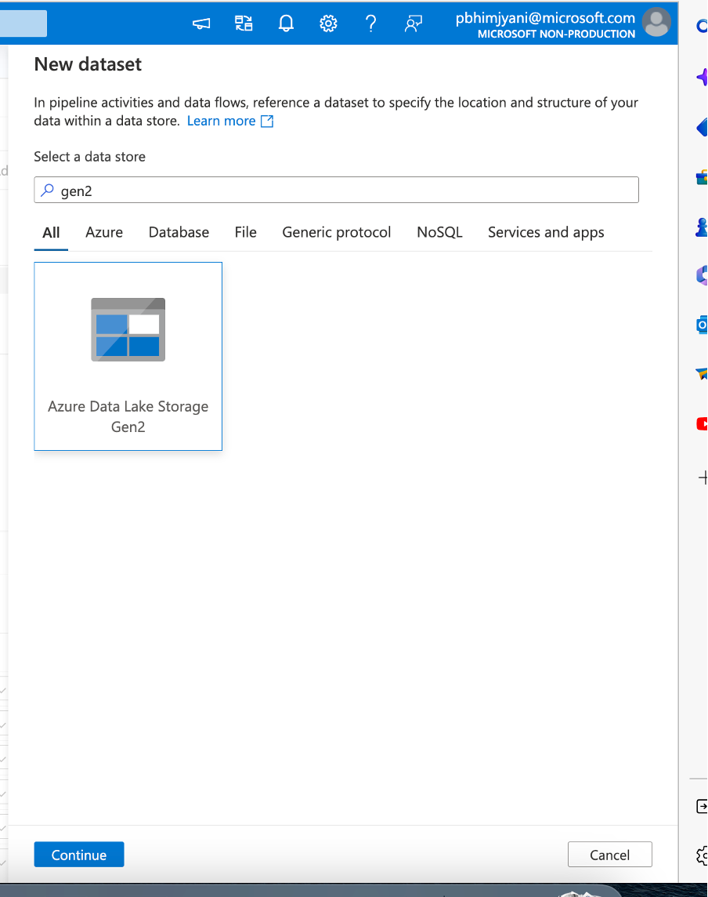
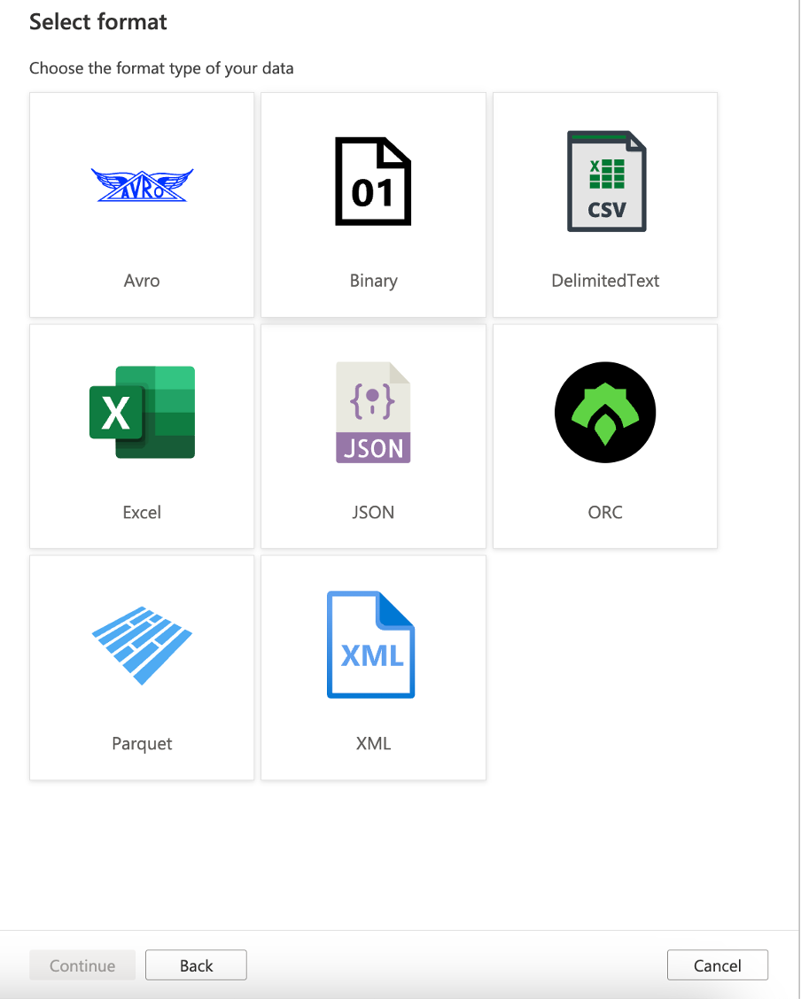
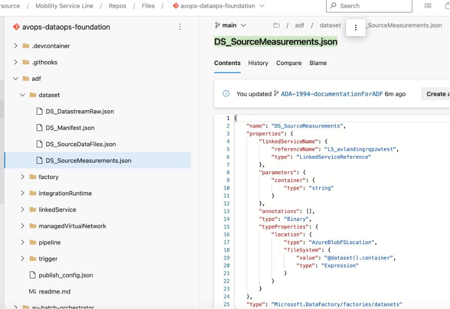
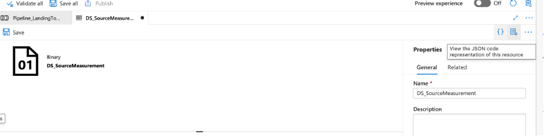
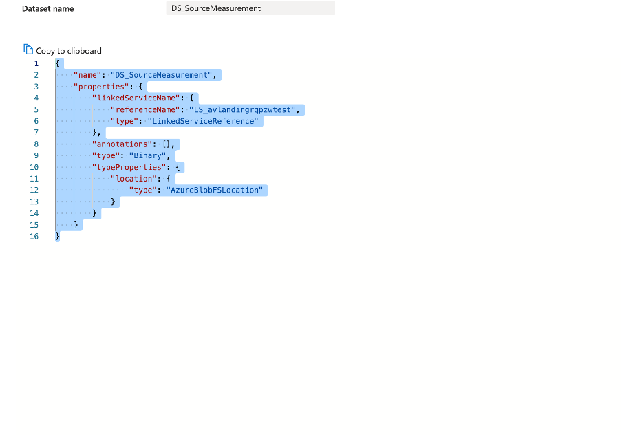
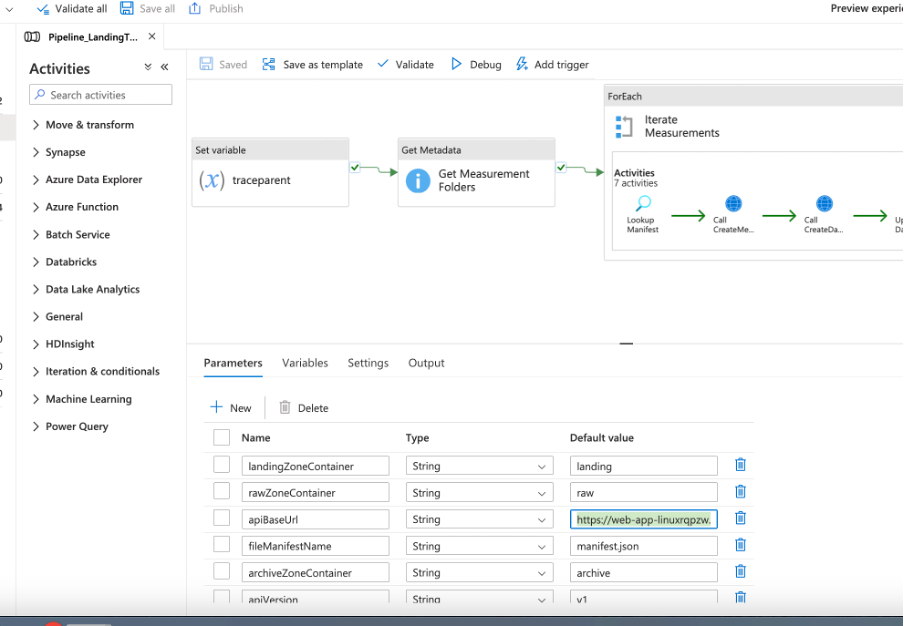
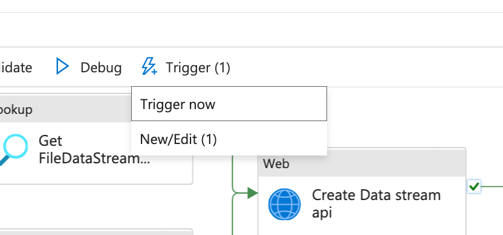
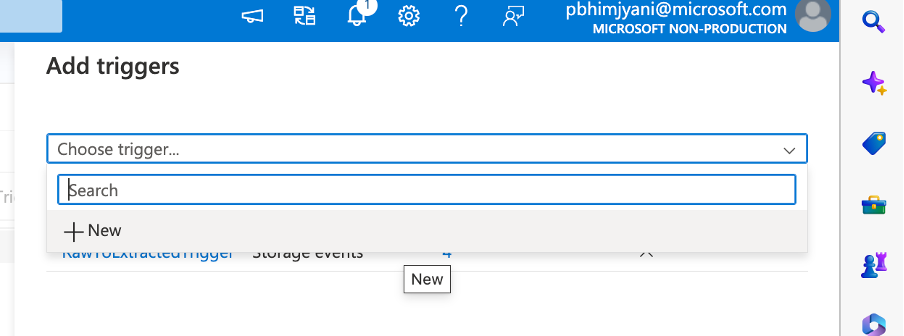
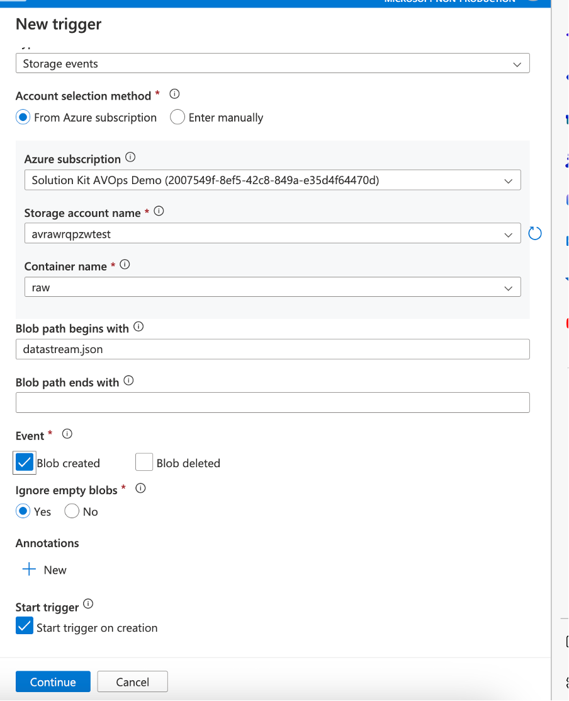

# ADF Pipelines Creation in a particular RG
Below steps will help you create the ADF pipelines in the required Resource group

1. Go to portal.azure.com and select the right subscription and right resource group

2. Go to the resources under the desired resource group and click on the Azure Data Factory

3. An ADF Studio shall open

4. Prior to the Datasets we need to check the Linked Services are there (which are created by IAC)

5. Next we create the Datasets.

   Step 1 : Go to the ADF studio, click on New Datasets,

   

   Step 2 : There choose ADLS Gen 2

   

   Step 3 : Then type of Data format, in our case binary or json

   

   Step 4 : Go to the Code Repo main branch https://dev.azure.com/chrysalis-innersource/Mobility%20Service%20Line/_git/avops-dataops-foundation
   Navigate to adf/dataset and copy the name of the dataset you want to create in the ADF studio

   

   Step 5  Click on {} icon on the right top 

   

   Step 6 : Replace the Code copy paste the json of "DS_SourceMeasurements.json" in the ADF studio and click on save

   

 
6. Be careful to replace the Linked Service of test RG to the Linked Service of your resource group. 

7. It will not save in case any resource names are different/inaccurate

8. Once save succeeds, create all the Datasets

9. Post that proceed to Pipelines. The first one is avops-dataops-foundation/adf/pipeline/Pipeline_LandingToRaw_SolutionKit.json

10. Copy the name of the Pipeline "Pipeline_LandingToRaw_SolutionKit" and create a new Pipeline. Paste the code json, or override in the new pipeline which you created with same name. Follow the pop-ups for error correction.

11. Once the Datasets and Pipelines are in place, go to the pipeline -- > Parameteres -->apiBaseUrl 

12. Change the web app base url to the one used in the desired Resource group

   

13. Append a '/' after the end of base url

14. Validate the pipeline and run them in debug mode and verify them

15. Next proceed to the "adf/pipeline/Pipeline_RawToExtracted_SolutionKit.json". Copy the json, Go to ADF studfio, create the new pipeline with same name and override the json. Make sure that the LS names are overriden/replaced properly as per the resource group.

16. Once the pipeline gets saved, Go to Trigger --> Add new Trigger, copy json and override and repeat.

   Step 1 :

   

   Step 2 : 

   

   Step 3 : 

   

# ADF Pipelines Deploy
Below steps will deploy the ADF objects through an azure devops pipeline.

1. Go to your Azure devops project (https://dev.azure.com/<ORG_NAME>/<PROJECT_NAME>) in your favorite browser.

2. Navigate to the Pipelines option in Azure Devops from the left menu options.

3. Click the pipeline named `avops-dataops-foundation-adf-cd`.

4. Click the blue colored Run Pipeline Option on the top right of the browser page.

5. Select your branch name, environment and other required parameters and hit the blue Run button in the down right corner of the browser

## [TroubleShooting](TroubleShooting.md)