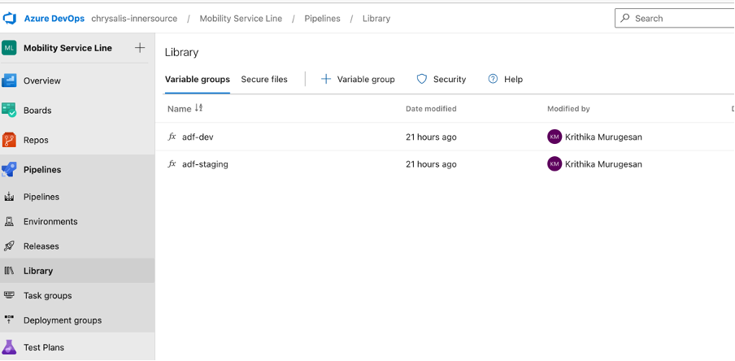

1. Make sure the .pipelines folder in ADF that contains the pipeline code and dependencies is present in the branch used for triggering
2. The environments to be deployed to should be present in the pipeline code as parameters, the code already has parameters for dev and stg environments.

3. Make sure the environment variables for different environment values are latest in the Pipeline Library.

	

	
4. Make sure the NodeTool version is the latest available version 