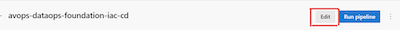
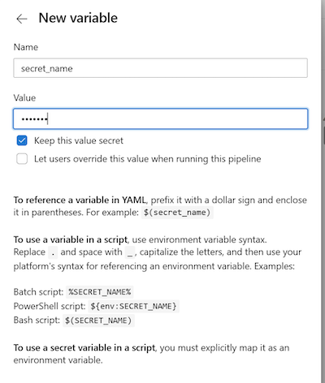

# Deploy the Core Infrastructure

## 0. Setting up your Azure Devops deployment 
* The solution kit uses Azure Devops for running CI/CD pipelines. To deploy this solution in your azure devops instance, you have to do following steps.
    * Clone [this](https://dev.azure.com/chrysalis-innersource/Mobility%20Service%20Line/_git/avops-dataops-foundation) repository in your azure devops instance (https://dev.azure.com/<ORG_NAME>/<PROJECT_NAME>).
        * You would require to generate git credentials to clone this repository in your azure devops instance.
    * Import pipelines from [this project](https://dev.azure.com/chrysalis-innersource/Mobility%20Service%20Line/_build), by following azure [docs](https://learn.microsoft.com/en-us/azure/devops/pipelines/get-started/clone-import-pipeline?view=azure-devops&tabs=yaml).

## 1. [Setting Up the Terraform Backend](../../../core-infrastructure/terraform/root/README.md)

## 2. Setting Up the Infrastructure CD

### a. Set the below secrets in azure devops
1. appId - Service Principal app ID.
2. password - Service Principal password
3. tenant - Service Principal tenant ID
4. subscription - Subscription ID of your Azure subscription
5. TF_STORAGE_ACCOUNT_KEY - Access Key of your azure storage account that you have configured as your terraform remote backend.

- To set the secerts follow these steps - 
    1. On the AzDo project go to pipelines and select `avops-dataops-foundation-iac-cd`. 
    1. Click on Edit 
    
    1. Click on Variables. 
    
    1. Add the variable name and value and select the box `Keep this value secret`
    
    1. Click on `OK` and the secret will be added. 

### b. Update the terraform vars
* Create a new tfvars file for your environment with naming <env>.tfvars
* Update your tfvars file located at this [path](../../../core-infrastructure/terraform/root/) with the <env> name. You can take reference from test.tfvars in this repository.

* Note: [Click-Here](https://learn.microsoft.com/en-us/azure/devops/pipelines/process/set-secret-variables?view=azure-devops&tabs=yaml%2Cbash) to know How to setup the secrets in azure devops

### c. Pipeline steps

1. Go to your [Azure devops project](https://dev.azure.com/chrysalis-innersource/Mobility%20Service%20Line) in your favorite browser.

2. Navigate to the Pipelines option in Azure Devops from the left menu options.

3. Click the pipeline named `avops-dataops-foundation-iac-cd`.

4. Click the blue colored Run Pipeline Option on the top right of the browser page.

5. Select your branch name, Environment and hit the blue Run button in the down right corner of the browser.

6. Now relax and grab a cup a coffee and be right back at the pipeline run after 10-15 minutes. Check the status, if it's failed, go to the Troubleshooting steps as linked at the end of this page.

## Core Infrastructure validation
After deploying the solution core infrastructure, make sure to tally with the below image's core azure resources,  if they are existing in your Resource Group.

## [Next Steps: Deploy MetaDataAPI](../MetaDataAPI/MetaDataAPIDeploy.md)

## [TroubleShooting](TroubleShooting.md)