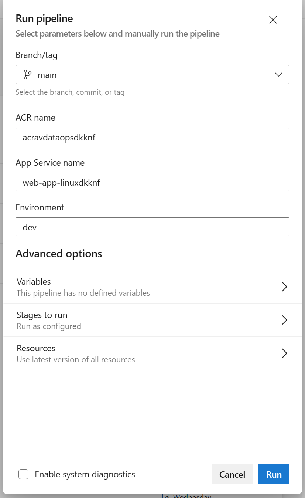

# MetaData API deploy

## Prerequisites

### Create service connections
- **ARM Service connection** - This is needed to deploy the docker image to App Service. Name the service connection "arm_service_connection_{env}", this is the format in which it is referred in the pipeline. 
* Note: {env} name should be same as used in the Pre-Deploy and Core infra steps.

- **Docker Registry(ACR)** - This service connection is needed to login to the Axure Container Registry and push the metadata-api docker image to the registry. Name the service connection "acr_service_connection_{env}", this is the format in which it is referred in the pipeline.

**Note**: Refer this [article](https://learn.microsoft.com/en-us/azure/devops/pipelines/library/service-endpoints?view=azure-devops&tabs=yaml) for more details and steps to create a service connection.
 
## Pipeline Run

This pipeline pushes the MetaData API docker container in to the ACR and then deploys to a linux web app container in your azure resource group.

1. Go to your [Azure devops pipelines](https://dev.azure.com/chrysalis-innersource/Mobility%20Service%20Line/_build) in your favorite browser.

2. Click the pipeline named `avops-dataops-foundation-metadata-api-ci`.

3. Click the blue colored Run Pipeline Option on the top right of the browser page.

4. Select your branch name, fill up the environment name you selected in the core infra deploy and fill up the other required fields name from the azure portal. Finally, hit the blue Run button in the down right corner of the browser.

## Verification of API
* Go to the azure web app in your resource group.
* Whitelist your self public IP in the networking section.
* Check the web app url, if you get 404, you are lucky.
* Now append a "/docs/" suffix to the url and check, if you see a swagger page, metadata-api is successfully deployed.

## [Next Steps: Deploy ADF Pipelines](../ADFPipelines/ADFPipelinesDeploy.md)

## Troubleshooting

* If metadata-api is not up, debug the container by going to Monitoring -> Log Stream in the App service, check for errors.
* Next step is try to deploy the image manually to app service from the acr.