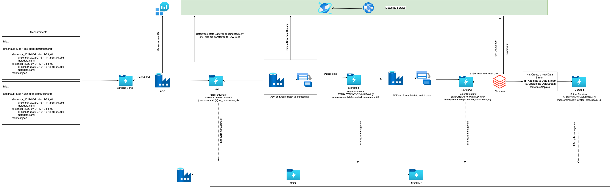
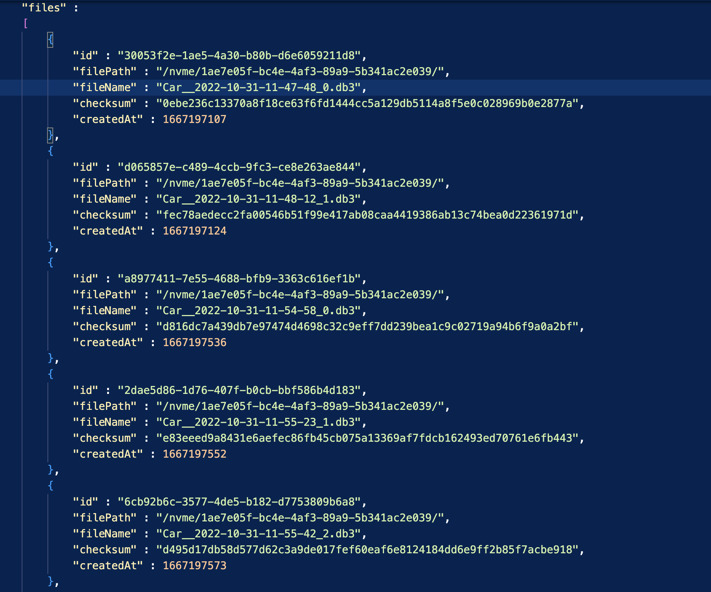
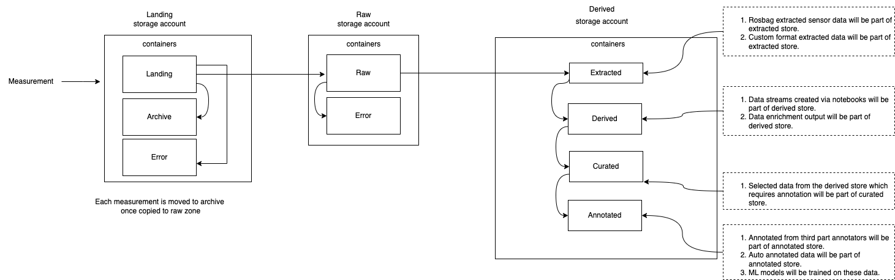
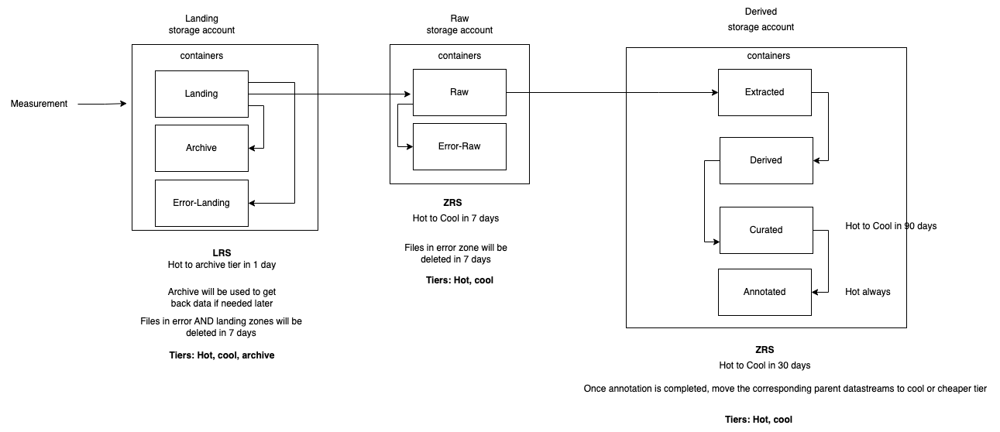

# Architecture

AvOps platform is to ingest the data collected by the test vehicles, store it on the cloud and make it available for the ML engineers to train their models.
Sensor data is recorded by loggers in the vehicle, stored on a [Data box](https://azure.microsoft.com/en-us/products/databox) in the vehicle and then uploaded to Azure Cloud. 

Each drive taken by the driver is called a measurement. A measurement (recording) can include different datastreams for [different sensors](https://www.nuscenes.org/) (camera, radar, GPS, lidar...). 

Essentially a measurement can be understood as a drive taken by the driver to capture certain diverse conditions, during a day the driver can collect several measurements as assigned to them.

Data at Vehicle is recorded in the [Rosbag files](http://wiki.ros.org/rosbag) along with the measurement and file manifest metadata files. The file manifest file will consist of the file related metadata.
The data files at the vehicle level are recorded for each measurement & are available in different folders for each measurement.




## File Manifest

This manifest file will contain the details of all the Rosbag files in the measurement. It is used to keep track of the files and whether they have all been coped over correctly.   



## Data Flow Between Zones

The three main data zones are Landing, Raw and Derived. Each data zone is an ADLS Gen 2 storage account with multiple containers under it.



- Landing Zone is the storage account into which all the measurements from the vehicles are uploaded and validated. Only valid measurements are copied over the Raw Zone and raw datastreams are created for them.
- Raw Zone is where the raw datastreams are stored. Extraction and other processes run on these datastreams.
- Derived Zone is where the derived datastreams like extracted, curated and annotated are stored. Annotated datastreams are finally used for the training of the ML models. All the datastreams created via notebooks will be stored as a derived type of datastream


## Data Pipelines

For movement between the data zones we have built modular and repeatable data pipelines which can be chained together. Each data pipeline is composed of:
- **ADF** provides an easy, low code way to orchestrate the creation/updation of datastreams and invocation the Azure Batch. It becomes easier to track and rerun the ADF pipeline in case of failures or process changes.
- **Azure Batch** is used for scalable and efficient processing of the Rosbag files. It is possible to parallelise the tasks run on each Rosbag file and complete the entire processing in a shorter duration.
Azure Batch also makes it possible for us to utilise  spot VMs which provides cost savings especially when data is of this scale.

### Landing zone to Raw zone

 
Once data is available at the Landing Zone, an ADF pipeline is triggered at the scheduled interval to process the data. This ADF pipeline will do the following: 


- Lineage Tracking: Pipeline will call the Metadata API to create a new datastream, for each measurement there is a datastream of type “Raw”.  

- After creating the datastream, the data is copied to the Raw folder in the ADLS. The data in the Raw folder has a hierarchical structure.  
```
    raw/YYYY/MM/DD/VIN/MeasurementID/DatastreamID  
```

- Once all the data is copied to the Raw folder, another call to Metadata API is made to mark the datastream as “Complete” so this can be consumed further.  

- Once all measurement files are copied, the measurements are archived and removed from the Landing zone

### Raw zone to Extracted Zone 

The data in the Raw zone is still in the Rosbag files which needs to be extracted from the Rosbag files so the downstream systems can consume them in the different format.  

The files from the Raw zone are processed by the ADF & Azure batch services which read the data from the topics in the Rosbag files and outputs the data into the selected topics into the respective folders.  

The files in the Raw zone are Rosbag files which can each be more than 2 GB in size. For each file, we have to run multiple processing like image processing, lidar/radar/GPS processing etc. ADF and Azure Batch provides us a way to do this in a parallel and scalable fashion.

The structure at the Extracted zone is also hierarchical and is in the similar format as Raw zone. 
```
    extracted/YYYY/MM/DD/VIN/MeasurementID/DatastreamID 
```

- We chose this hierarchical structure as it utilizes the hierarchical namespace capability of ADLS Gen 2 and helps us in having scalable and cost effective object storage and improves efficiency of the object search and retrieval. Partitioning by year and vehicle ID makes it easier to search for the relevant images from the corresponding vehicles


## Data Lifecycle

We are using [ADLS Gen 2](https://learn.microsoft.com/en-us/azure/storage/blobs/data-lake-storage-introduction) for the storage accounts and they are of the type Standard, storage V2, NFS enabled, inside VNET and with private endpoints enabled.
The redundancy for the storage account is LRS for landing zone and ZRS for the other zones.

The size of the data in the storage accounts can increase massively and hence [data lifecycle management policies](https://learn.microsoft.com/en-us/azure/storage/blobs/lifecycle-management-overview) are important here.
Data lifecycle policies are available to move the data between the tiers and should be moved on basis of created at date. This will ensure that the files of the measurement and datastream are moved together.

Tiers available for data lifecycle management are hot, cool and archive.
Hot and cool are the online tiers. Archive is the offline tier.

