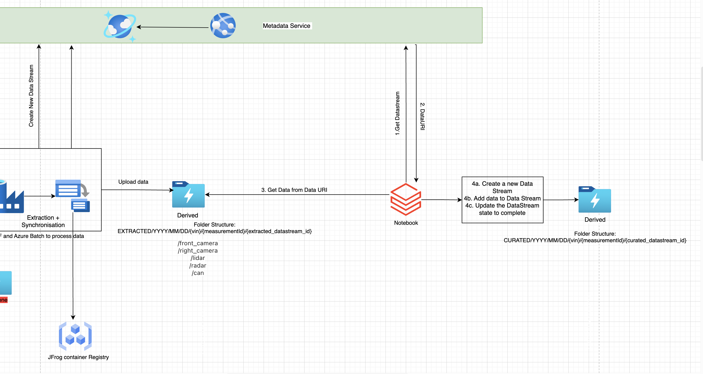

# Data Discovery

There are two kinds of data in system
* [Metadata](data-model.md) – The Measurements, the data streams (Raw / Derived) are stored in Cosmosdb.
* Data in Azure data lake – All raw data, extracted data, enriched data, curated / Annotated data lives in [Azure data lake storage (ADLS)](https://learn.microsoft.com/en-us/azure/storage/blobs/data-lake-storage-introduction).

User should be able to discover both kinds of data effectively which means
* Discovering Metadata like measurement, DataStream by ids, by tags, by date ranges, and by attributes; also discovering lineage of datastreams.
* Ability to query the data in Azure data lake. The format of data are varied like Rosbag files, images, csv, parquet, json etc. The ML engineer should get full flexibility with familiar environment of Python/Scala/R to query and process this data.

The solution kit is using [Azure Data bricks](https://azure.microsoft.com/en-us/products/databricks/) as a solution to read data from Azure data lake, and for most formats like csv, json, parquet one can read files in to external spark tables and do SQL queries on Spark/Hive tables.

The data discovery feature does the following:
1. Provision an Azure Databricks cluster with scalability and spot instances enabled to save cost.
2. Python Notebooks that are retained even when server is not running.
3. Notebook with following steps –
    
    a. Connect securely using Service principal with ADLS
    
    b. Call Metadata API to get Uri of data
    
    c. One sample case of Yolo annotations or any json/csv annotations data to load from uri in above step
    
    d. Build an external table and do SQL Query
    
    e. Build a new datastream for the external table, persist external table for future reuse.
    
    f. Show directly loading an external table and work with it.

4. This notebook will serve as a template for ML devs who are new to big data world but can get them up and running in no-time to load and query data.

This architecture allows us to achieve scale and flexibility in further data discovery, feature engineering and Model training process. You can swap and use other big data tech like [Azure HD Insights](https://azure.microsoft.com/en-us/products/hdinsight/) or [Azure Synapse](https://azure.microsoft.com/en-us/products/synapse-analytics/) as well to work with this datalake without disturbing any other components.

This architecture is also cost efficient to work with as the compute in databricks is only used when you are running notebooks and you can terminate clusters when you are not using them which means you just pay for storage which is anyways cheaper.

This is a good handoff to MLOps scenario as well because the notebooks and tooling on Azure Databricks is in their purview and this point onwards built features can be part of the MLOps workflow.

You can see more on how to setup the data discovery [here](../data-discovery/README.md).

---
Next read more on [CI/CD](ci-cd.md)

[Home](../README.md)