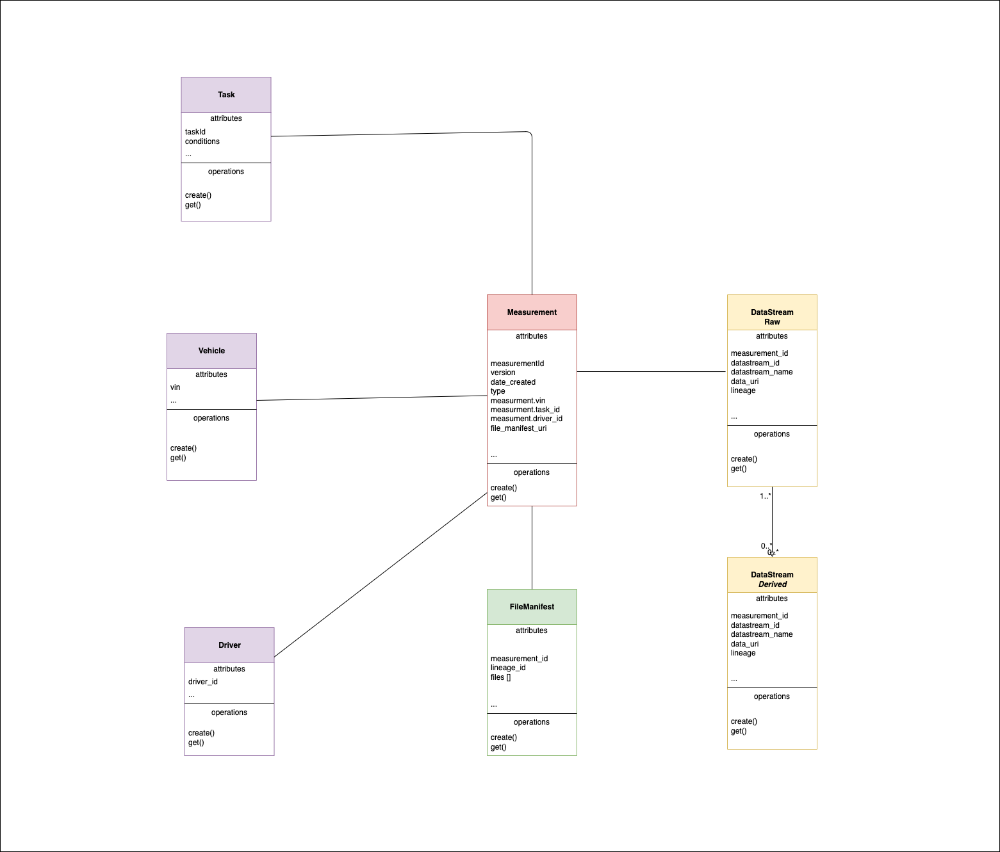
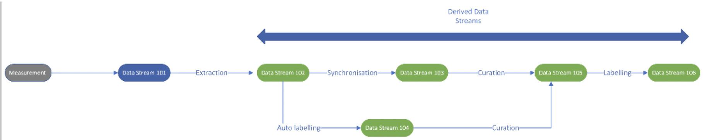

# Data Model

Data recorded in the car is in the form of [Rosbag files](http://wiki.ros.org/rosbag).

For AVOps and for training of the needed ML models, a diverse set of data on the roads is needed. This data could be about driving the car in different traffic conditions, different weather conditions, lane cutting etc. 
Admins create a list of tasks which map to these conditions and assign the tasks to the drivers. The driver then start with the tasks assigned to them. 

When the conditions are correct for the task at hand ex: driving on a sunny day in a heavy traffic situation, then the driver starts the task by starting the recording in the car.

## Measurement
This recording by the data collector in the car is stored as a bunch of Rosbags under a measurment.
When the driver starts recording for a task, the measurement is created and all the Rosbags for the same are added under it.

## Datastream
Once measurement comes into the Landing zone in the cloud, a raw datastream is created from it. All processes on top of the raw datastream cause derived datastreams to be created. As you can see in the diagram, extraction process on the raw datastream will create an extracted datastream from it. Any datasteam built on top of a raw datastream is a derived datastream.

## Data Lineage
We maintain the lineage of the data from the measurement to the derived datastream. This makes it easy to track which Rosbag had the files for the derived datastream. This becomes important when auditing is happening and we need to understand which videos and images went into the training of the ML model. Hence lineage of the data becomes important from the audit and legal standpoints.

## Datastream statuses
- raw 
- extracted 
- derived
- curated
- annotated

---
Next read more on [Data Discovery](data-discovery.md)

[Home](../README.md)