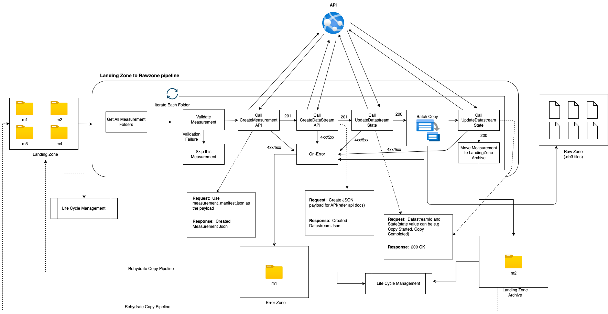
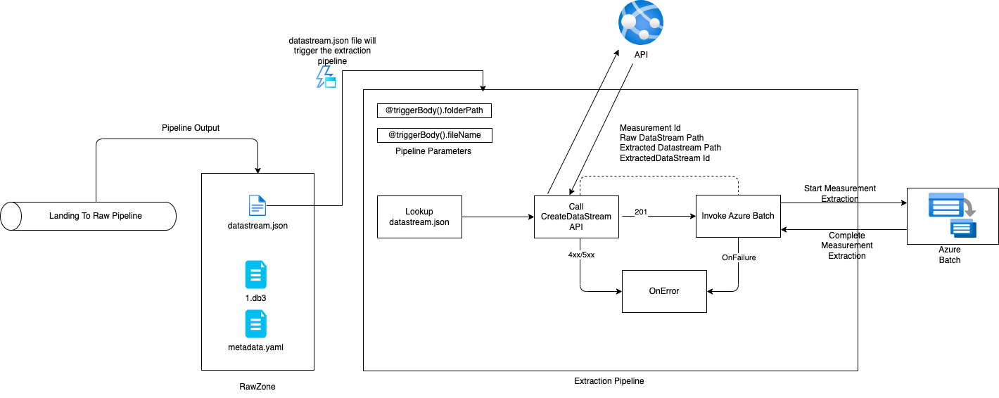
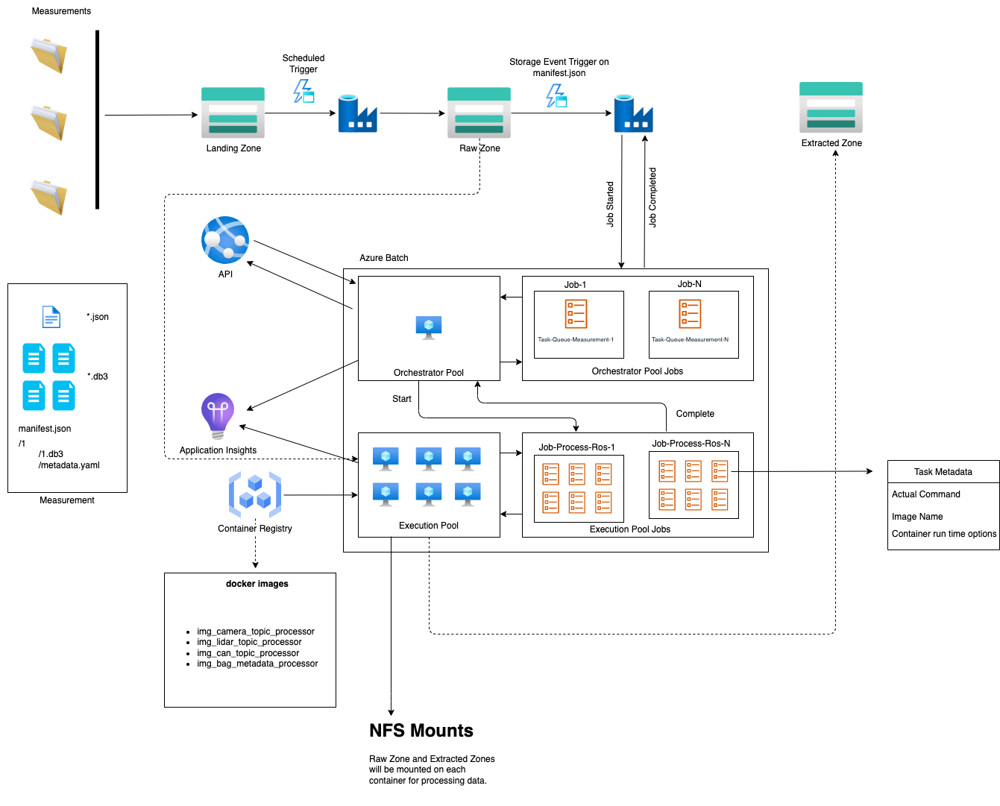
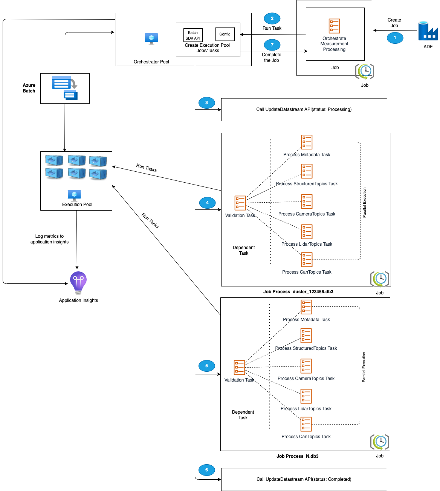

# Data Pipelines

## Design

## Landing to Raw Zone
### ADF Copy Pipeline

This pipeline is triggered based on a schedule. Once triggered, the data will be copied from landing zone to raw zone.



Once the pipeline gets triggered it will fetch all the measurement folders and iterate through all of them. Here is the sequence of activities that will happen against each measurement:

**Validate Measurement**: This will grab the file manifest file from the measurement manifest and check if all the rosbag files for this measurement exist in the measurement folder, on successful validation proceed to the next activity and on failure skip this measurement and proceed to the next measurement folder.
 
**Call Create Measurement API**: Make a web API call to the create measurement API and pass the json payload from measurement manifest json file. On successful call parse the response to retrieve the measurement Id and on failure move to the on error activity.

**Call Create Datastream API**: Make a web API call to the create datastream api by creating the required json payload. On successful call parse the response to retrieve the datastream id and the datastream location. On failure move to the on error activity.

**Call Update Datastream State API**: Make a web API call to update the state of the stream to Start Copy, on successful call start the copy activity to copy Rosbag files to the datastream location. On failure move to the on error activity.

**Copy Rosbag Files**: Azure Batch is used to copy Rosbag files from Landing zone to Raw Zone. ADF pipeline will invoke the Azure batch for copying a measurement. Copy module of orchestrator app will create following Copy job with following tasks for each measurement:

- Copy Rosbag files to Raw Zone
- Copy Rosbag files to Archive Zone
- Remove Rosbag files from Landing Zone

**Note**: Batch will make use of orchestrator pool for copying data and AzCopy tool is used for copying and removing data based on above tasks. AzCopy uses SAS tokens to perform copy or removal tasks. SAS tokens are stored in keyvault and are referenced via landingsaskey, archivesaskey and rawsaskey

**Call Update Datastream State API**: Make a web api call to update the state of the stream to Copy Complete, on successful call move to the next activity to delete measurement from the landing zone. On failure move to the on error activity.

**Move Measurement To Landing Zone Archive**: This activity will move the measurement files from landing zone to Landing Zone Archive. This will help to re-run a particular measurement by moving it back to Landing zone via hydrate copy pipeline. Life cycle management will be enabled on this zone to automatically delete or archive measurements from this zone.

**On-Error**: In this activity measurement will be moved to Error Zone where from it can be re-run by moving it to landing zone or can be auto deleted/archived by life cycle management.

**Notes**:
- These pipelines will be triggered based on a schedule, as it will help in better traceability of pipeline runs and avoid unnecessary pipeline runs.
- Pipeline will be configured with concurrency set to 1 to make sure previous run is completed before the next scheduled run.
- Pipeline will be configured to copy measurements parallelly, e.g if scheduled run picked up 10 measurements to copy, then above sequence of steps can be run concurrently for all the measurements.
- Pipeline will be configured to emit a metric in Azure monitor if the pipeline takes more than expected time to complete. 
- On-Error activity will be implemented in later observability stories.
- Partial measurements, which have rosbag files missing will be deleted automatically by life cycle management.


## Raw to Extracted Zone

After Rosbag files get copied to raw zone, we need to continue with the extraction of those bag files. In the extraction phase measurement will be treated as a one unit of extraction. Here is how the extraction flow for a measurement will look like:



Landing to raw zone copy pipeline will copy the .db3 files and once all the .db3 files get copied it will also create the datastream.json file in the raw data stream path.

Extraction pipeline will be triggered by a storage event trigger with filter set to trigger the pipeline when datastream.json gets created in the raw zone.


### Invoking Azure Batch From ADF

In the extraction pipeline, trigger will pass the path of the metadata file and the raw data stream path to the pipeline parameters. ADF will use the Lookup activity to parse the json from manifest file and raw datastream Id can be parsed from the raw data stream path by parsing the pipeline variable.

ADF will call web activity to create a new datastream by calling the create datastream API. The create data stream api will return the path for the extracted datastream. The extracted path will be added to the current object and ADF will invoke the Azure batch via Custom Activity by passing the current object after appending the extracted datastream path like below:

```
{
"measurementId":"210b1ba7-9184-4840-a1c8-eb£397b7c686",
"rawDataStreamPath":"raw/2022/09/30/KA123456/210b1ba7-9184-4840-
alc8-ebf39767c68b/57472a44-0886-475-865a-ca32{c851207",
"extractedDatastreamPath":"extracted/2022/09/30/KA123456
/210bIba7-9184-4840-a1c8-ebf39767c68b/87404c9-0549-4a18-93ff-d1cc55£d8b78",
"extractedDataStreamId":"87404bc9-0549-4a18-93ff-d1cc55fd8b78"
}
```

### Azure Batch Design


All the extraction logic will be packaged in different container images based on the extraction processes. Azure batch will run those container workloads parallelly for the extraction of Rosbag files.

Since ADF doesn’t support running batch container workloads so we will use two batch pools, an orchestrator pool(non container) and an execution pool(container based) for processing our work loads. ADF will invoke the orchestrator pool which will orchestrate the container workloads for the rosbag extractions. Here is the design for batch processing:




### Design Components
### Batch Pools

- **Orchestrator Pool**: This pool will have linux nodes without container runtime support and will run a python code which will use batch API to create jobs and tasks for the execution pool and monitor will those tasks. ADF will trigger this pool with the required configurations. 
- **Execution Pool** : This pool will have linux nodes with container run time to support running container workloads. For this pool jobs and tasks will be scheduled via the orchestrator pool.

**NFS Mounts**
Storage accounts from which data will be read and written will be mounted via NFS 3.0 on to the batch nodes and the containers running on the nodes. This will help batch nodes/containers to process data quickly without downloading the data files locally on to the batch nodes.

**Note**:- Batch and Storage account need to be in the same vnet for mounting. 

**Application Insights**

Application Insights can be integrated to log custom events, custom metrics and log information while processing a particular measurement for extraction. This will help in building the observability around measurement extraction. We can build queries on log analytics to get the all the details about a measurement.

**Container Registry**
All the container images required for processing in the execution pool will pushed to container registry(JFrog) and execution pool will be provided with configurations to connect to this registry and pull the required images.

### Step wise extraction process




1. ADF will schedule a job with one task for the orchestrator pool to process a measurement for extraction. It will pass the following information to orchestrator pool:

- Measurement Id
- Location of the Rosbag files that need to extracted.
- Destination path where the extracted contents will be stored. 
- Extracted Datastream Id

2. Orchestrator pool will invoke the Update Datastream API to set the status of the datastream to PROCESSING.

3. Orchestrator pool will create a job for each rosbag file which is part of measurement and each job will have the following tasks:

- Validation Task: This will be a dependent task to all the following tasks of the job. Here we can validate if the rosbag file is good for extraction.
- Process Meta Data Task: This task will be responsible for deriving the mettadata from a rosbag file and enriching the files meta-data collection via files update metadata api.
- Process StructuredTopics Task: This task will be responsible extracting structured data from the given rosbag file. List of topics from which structured data need to be extracted will passed as configuration.
- Process CameraTopics Task: This task will be responsible extracting images data from the given rosbag file. List of topics from which images need to be extracted will passed as configuration.
- Process LidarTopics Task: This task will be responsible extracting lidar data from the given rosbag file. List of topics from which lidar data need to be extracted will passed as configuration.
- Process CanTopics Task: This task will be responsible extracting can data from the given rosbag file. List of topics from which can data need to be extracted will passed as configuration.

4. Orchestrator pool will monitor the progress of each task and once all the jobs are completed for all the rosbag files, it will invoke Update datastream API to set the status of datastream to COMPLETED.

5. Orchestrator will exit gracefully.

Note: For all of the above(defined in #3) tasks there will be a separate container image which will have the corresponding logic defined for a task and will accept certain configurations like where to write the output, which Rosbag file to process, an array of topic types [“sensor_msgs/Image“] etc. When validation will be implemented then all the tasks will depend on the validation task and it will be created as a dependent task to proceed. All of the other tasks can process independently and can run in parallel.

In the solution kit, we currently have only the process CameraTopics Task. Other tasks like the validation task and the sensor data tasks can be added later.

### Running tasks concurrently
Usage of batch compute nodes can be maximized by running more than one task simultaneously on each node. Parallel task execution is configured at the batch pool itself. 

### References:
[Creating jobs and tasks via python api](https://learn.microsoft.com/en-us/azure/batch/quick-run-python)

[Task dependencies](https://learn.microsoft.com/en-us/azure/batch/batch-task-dependencies)

[Enable parallel task execution](https://learn.microsoft.com/en-us/azure/batch/batch-parallel-node-tasks)


---
Next read more on [Data Model](data-model.md)

[Home](../README.md)