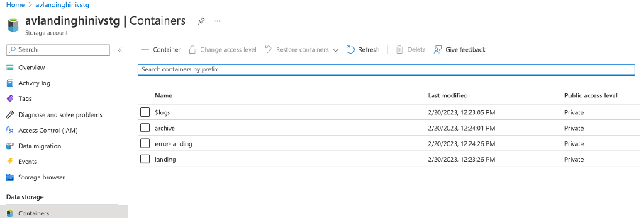
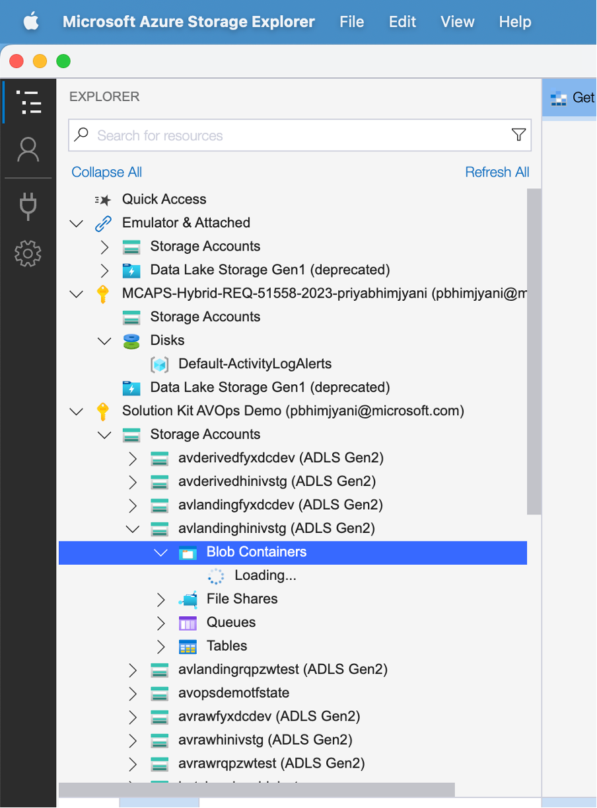
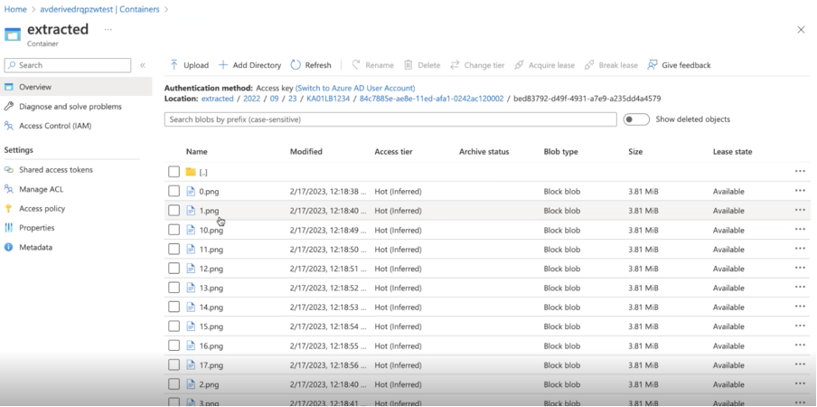

# Steps to Run a Successful Demo

## Pre-requisites:

1. The batch orchestrator pool should be scaled from 0 to 1. This has been kept 0 to save costs, hence do ensure to scale it up to 1 ,before starting a pipeline run.

## Uploading the Measurement to the Landing Zone

1. Go to the path : sample-data/ros2/ 

2. Download the contents of the folder, which is actually a sample measurement "1e211e94-b27b-11ed-afa1-0242ac120002"

3. Each measurement id is a uuid.

4. It contains manifest.json whose first field, id should match the name of this measurement folder.

5. After downloading the measurement. Upload it to the Landing storage account's landing container

6. If you use the Azure portal, you need to create a new folder with the name of this measurement folder.
   Go one level down, upload the manifest file and create a folder called "file1".
   Go one level down, inside the file1 and upload the ros2 files which come in a pair, here in this example we have convert.db3 and metadata.yaml

    
   OR

   If you use the Azure Storage Explorer, you can upload the entire measurement folder.

    

7. Once you have the measurement in the landing zone, 
   Go to the ADF Studio, Go to the Landing to Raw Pipeline.

8. Click on Debug to run the pipeline

   Later on you can also create a "Scheduled Trigger" which will do away with the manual effort of running the "Landing to Raw" Pipeline and on the basis of the interval, lets say hourly, as soon as the landing zone has soome measurememts or 1 measurement, the pipeline will trigger.

9. Go to the Monitor Section - Debug Runs, to see the pipeline Run

10. The next pipeline is the "Raw to Extracted Pipeline which kicks off once the "datastream.json" arrives in the raw container.

11. Once the Raw to Extracted Pipeline completes, you can view the extracted images in the extracted container of the derived storage account.

     

12. Once your pipeline run is comepleted, for both the Landing to Raw and Raw to Extracted, please make sure to scale down the batch orchestrator pool node to 0 , again to save costs

### To note:

We have 3 storage accounts

1. The Landing Stoage Account which is an ADLS Gen 2 Storage Account, has few containers called : archive, error, lanidng

2. The Raw Storage Account which is an ADLS Gen 2 Storage Account, has another set of containers called raw, error etc

3. The Derived Storage Account which is an ADLS Gen 2 Storage Account, has another set of containers called extracted, derived, synchronized, curated, annotated. We use the "extracted" container in this solution kit.

## Video Recording Of a Sample Run :

[Link To Demo Video](https://microsoftapc-my.sharepoint.com/:v:/g/personal/pbhimjyani_microsoft_com/EaW7ntPo6IVOlcdMVPfiZV4BxmE-lnfgFrMUWiKIgCJghg?e=UoMoqR)

