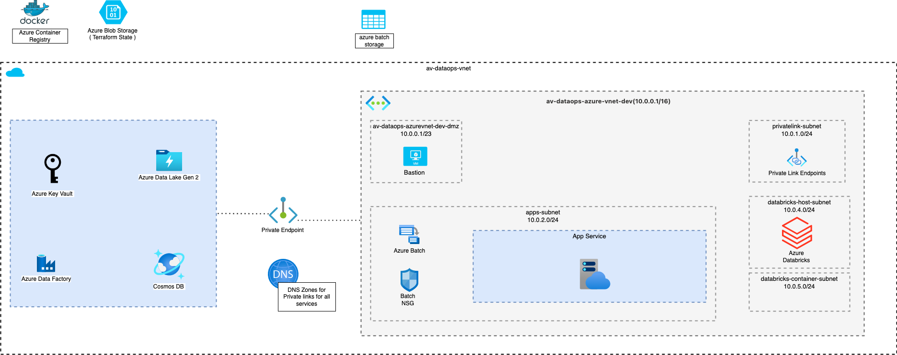

# Network Design 

## Core Infrastructure Network Diagram
Below diagarm shows how the overall core infrastructure is setup behind a vnet `av-dataops-vnet`. Find few important points below.
* All resources are confined in the outer dotted line which is a vnet boundary. One can whitelist their IPs to work with resources behind the vnet or login to an optional bastion host which is optionally deployed in the same vnet.
* There are dedicated subnets in the `av-dataops-vnet` for different azure services.
    * apps-subnet
        * metadata api is deployed in this subnet
    * privatelink-subnet
        * azure resources are connected via a private link created in this subnet
    * databricks-subnets
        * There are two subnets viz host-subnet and container-subnet. Azure databaricks uses these subnets to connect to other services for data discovery purposes
    * bastion-host-subnet
        * Optional bastion host required for debugging issues is deployed in this subnet
* Service delegation is used wherever required.
* There are few expceptions, as you can see ACR(azure container registry), Batch storage account and terraform storage account are publicly exposed. We can plan to make them private as well going forward.

