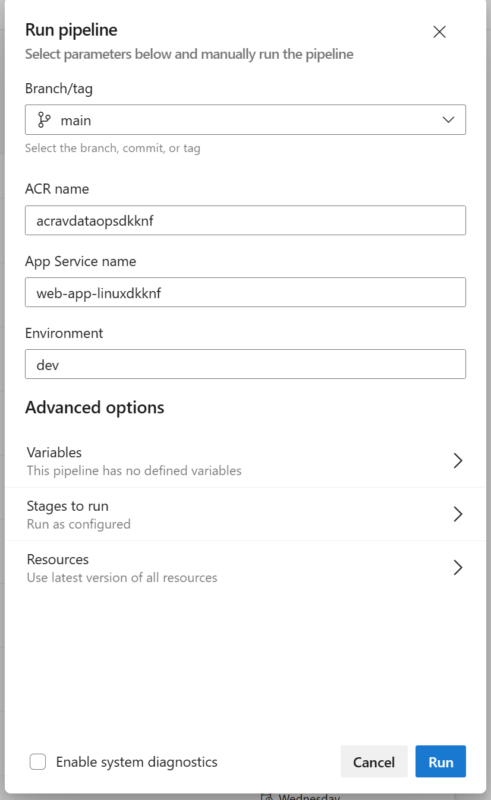

# avops-dataops-foundation-metadata-api-ci

This pipeline automates the integeration and deployment of the metadata API to Azure App Service.

## Pre-requisites - 

1. Run the **avops-dataops-foundation-iac-cd** and set up your environment on Azure. Refer this [document](../../core-infrastructure/.pipelines/README.md) on steps to run the pipeline. 
1. Create service connections - 
    - **ARM Service connection** - This is needed to deploy the docket image to App Service. Name the service connection "arm_service_connection_{env}" (environments supported are dev and test), this is the format in which it is referred in the pipeline. 
    - **Docker Registry** - This service connection is needed to login to the Axure Container Registry and push the metadata-api docker image to the registry. Name the service connection "acr_service_connection_{env}" (environments supported are dev and test), this is the format in which it is referred in the pipeline. 
Refere this [article](https://learn.microsoft.com/en-us/azure/devops/pipelines/library/service-endpoints?view=azure-devops&tabs=yaml) for more details and steps to cretae a service connection.

## Pipeline parameters

The pipeline takes the folowwing inputs on running it via manual trigger. When the pipeline is triggered on merge to the main, it picks up the default values. You can change these default values based on your environment.

1. **acr_name** - Name of the Azure Container Registry.
1. **app_service_name** - Name of the Azure App Service. 
1. **env** - Type of the environment you wish to deploy to. Default value is dev.

## Pipeline Variables 

1. **src_dir** - Path of the source directory.
2. **test_dir** - Path of the directory containing all the unit tests.
3. **app_name** - Name of the application.
4. **image_repository** - Name of the image repository where the docker image of the app will be pushed. 
5. **tags** - Tags to assign to the docker image. The value is set to the build ID. 
6. **acr_service_connection** - Name of the Docker Registry service connection created in the previous step.
7. **arm_service_connection** - Name of the ARM service connection created in the previous step.

## Pipeline Stages 

1. **code_quality_checks** - 
    - **detect_secrets** - The [detect-secrets](https://pypi.org/project/detect-secrets/) plugin is used to run a check on secrets checked in the code. The results are published as pipeline artifacts.
    - **lint_and_unit_tests** - 

2. **Push_image_to_ACR** - 
    - **Login to ACR** - Login to the Azure Container Registry with the help of the *acr_service_connection* created in the previous steps.
    - **Build and Push to ACR** - Build the Docker image and push to the Azure Container Registry. 
    - **Deploy to Azure App Service** - Using the *arm_service_connection* the image is then deployed to Azure App Service.

## Steps to run the pipeline 

1. The pipeline is automatically triggered when a PR is merged to the main branch, containing changes in the "metadata-api/*" folder. 
1. To manually trigger the pipeline go to Pipelines in this AzDo project and select *avops-dataops-foundation-metadata-api-ci*. 
1. Click on "Run Pipeline" and fill in the values as asked by the prompt. Click on Run. 

