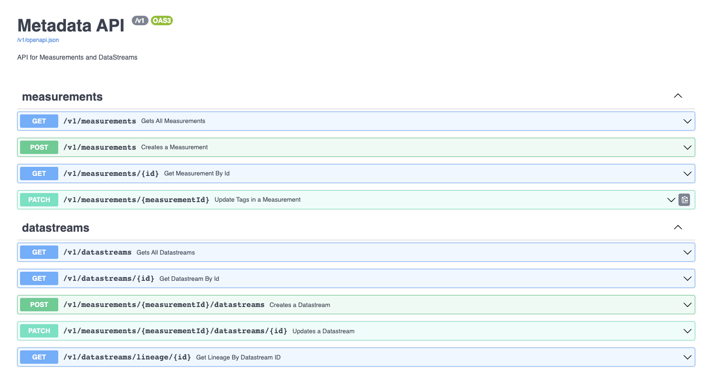

#Metadata API

Metadata API is built using FastAPI framework in Python and deployed in Azure App Service.
Metadata API is used for managing measurements and datastreams.

# Setting up Metadata API

1. Execute the following command to install depedencies : 

```
python -m virtualenv venv
source venv/bin/activate 
pip3 install -r requirements.txt
```

## Running the App 

### Inside VSCode

1. Set the connection strings in env.template and save the file as .env
2. Run the following command from the 'app' folder to start the app:
`uvicorn app.app:app --reload --port 3100`
 or run directly from VSCode using Run/Debug Option


### Runing in Dev Containers

1. Set the connection strings in env.template and save the file as .env
2. Open VSCode from api folder and a popup will appear in bottom right to Reopen In DevContainers.
3. Run the app directly from VSCode using Run/Debug Option 


### Running in Docker

```
docker build . -t fastapi-todo
docker run --env-file ./src/.env -p 3100:3100 -t fastapi-todo
```

### Swagger Docs
Swagger docs can be viewed at http://localhost:3100/docs once you deploy the api locally.
You can also try out the APIs through the Swagger UI.

